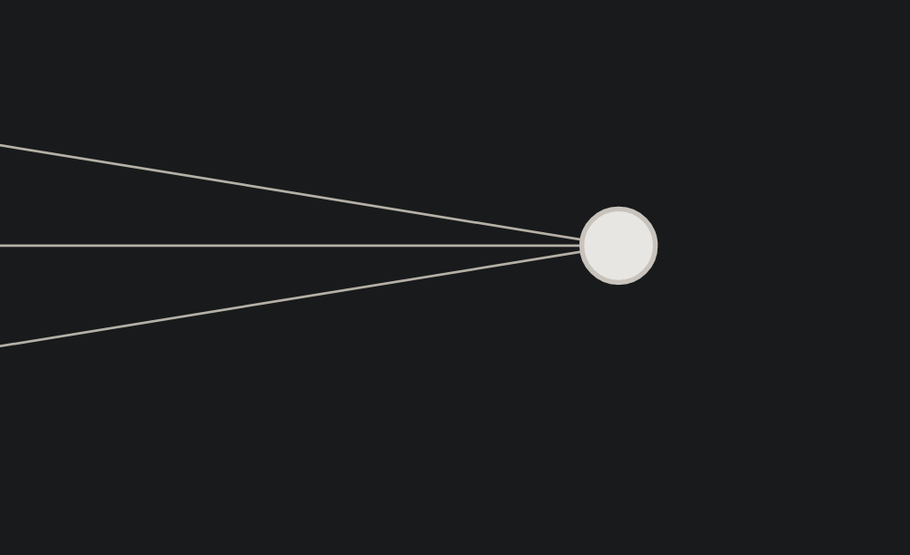
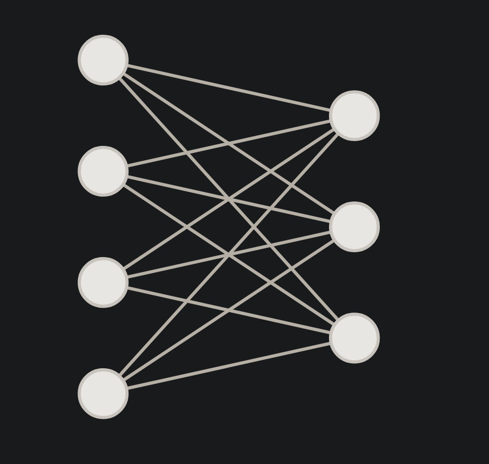

## Chapter 02 - Creating a neuron

---

You will require python, numpy and matplotlib for the rest of this journey.

&nbsp;

### Single neuron

---



Here you can see that the neuron has 3 inputs (plus there is a bias)

Now, seeing this programatically, we can create a neuron with 3 inputs and a bias.

```python
inputs = [1, 2, 3]
weights = [0.2, 0.8, -0.5]
bias = 2

output = (
(inputs[0] * weights[0]) + 
(inputs[1] * weights[1]) + 
(inputs[2] * weights[2]) + bias )

print(output)

>>> 2.3
```

[Single neuron with 3 inputs example](https://nnfs.io/bkr/)

&nbsp;

Now with 4 inputs it will look like this:

```python
inputs = [1, 2, 3, 2.5]
weights = [0.2, 0.8, -0.5, 1]
bias = 2
output = (
(inputs[0] * weights[0]) +
(inputs[1] * weights[1]) +
(inputs[2] * weights[2]) +
(inputs[3] * weights[3]) + bias )

print(output)

>>> 4.8
```

### Layer of neurons

Upto now we have looked at only one neuron.

Lets step it up to a layer of neurons.



Since we have a layer, instead of single neuron, we will now have a set of weights and biases.

Number of wights + biases pairs will be equal to the number of neurons in the output layer.

```python
inputs = [1, 2, 3, 2.5]
weights1 = [ 0.2,    0.8,   -0.5,    1]
weights2 = [ 0.5,   -0.91,   0.26,  -0.5]
weights3 = [-0.26,  -0.27,   0.17,   0.87]

bias1 = 2
bias2 = 3
bias3 = 0.5

outputs = [
    #Neuron 1
    (inputs[0] * weights1[0]) +
    (inputs[1] * weights1[1]) +
    (inputs[2] * weights1[2]) +
    (inputs[3] * weights1[3]) + bias1

    #Neuron 2
    (inputs[0] * weights2[0]) +
    (inputs[1] * weights2[1]) +
    (inputs[2] * weights2[2]) +
    (inputs[3] * weights2[3]) + bias2

    #Neuron 3

    (inputs[0] * weights3[0]) +
    (inputs[1] * weights3[1]) +
    (inputs[2] * weights3[2]) +
    (inputs[3] * weights3[3]) + bias3
]

print(outputs)

>>>[4.8,1.21, 2.385]

```

Visulaization of this code - [3 neuron layer with 4 inputs](https://nnfs.io/mxo/)

&nbsp;

### Making the same, but with loops in python

```python

inputs = [1, 2, 3, 2.5]

weights = [ [0.2, 0.8, -0.5, 1],
            [0.5, -0.91, 0.26, -0.5],
            [-0.26, -0.27, 0.17, 0.87] ]

biases = [2, 3, 0.5]

# Output of current layer
layer_outputs = []

# For each neuron
for neuron_weights, neuron_bias in zip(weights, biases):

# Zeroed output of given neuron
neuron_output = 0

# For each input and weight to the neuron
for n_input, weight in zip(inputs, neuron_weights):
# Multiply this input by associated weight
# and add to the neuron’s output variable

neuron_output += n_input*weight
# Add bias

neuron_output += neuron_bias
# Put neuron’s result to the layer’s output list

layer_outputs.append(neuron_output)

print(layer_outputs)


>>> [4.8, 1.21, 2.385]
```

Note - If you dont know about the zip() used in the above python snippet, refer here - https://realpython.com/python-zip-function/

### About matrix operations

&nbsp;
You should have a understanding of the following:


* Dot product
* Vector Addition
* Matrix Multiplication
* Transpose of a matrix

You can refer to khan academy for enough understanding on these topics.

I did not document it here, because I have already know it :sweat_smile: 

### Switching gears to numpy!

Numpy is da facto python library for matrix operations.

Now, we will replicate the above codes, but in numpy instead of pure python.

Numpy not only makes it easier to code, but also makes processing faster.

You are not likely to notice much of a performance difference in the code mentioned in this chapter, but when it comes to large matrices, the difference stars to be noticeable.

