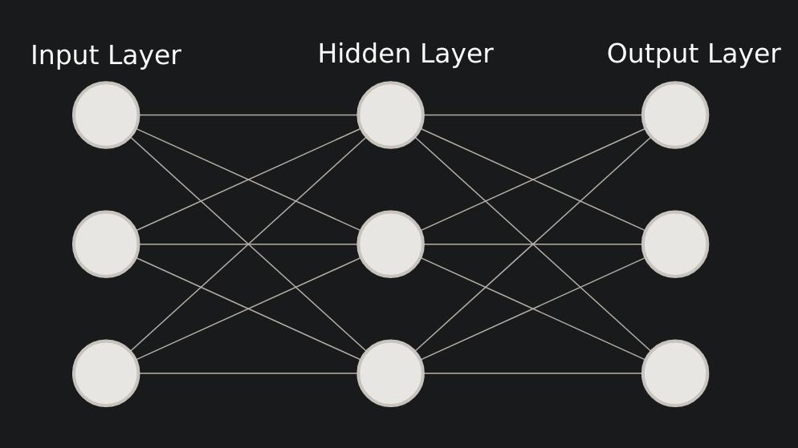

## Chapter 03 -- Adding layers

---

Previously we have looked at a single layer, how the neurons are activated. Now we will look at adding more layers to this network.

To make a new layer, we are gonna have new weights and biases, namely weights2, and bias2.

```python
import numpy as np

inputs = [1.0, 2.0, 3.0, 2.5]

weights = [ [0.2, 0.8, -0.5, 1],
            [0.5, -0.91, 0.26, -0.5],
            [-0.26, -0.27, 0.17, 0.87]]

biases = [2.0, 3.0, 0.5]

#Layer 2 stuff

weights2 = [[0.1, -0.14, 0.5],
            [-0.5, 0.12, -0.33],
            [-0.44, 0.73, -0.13]]
biases2 = [-1, 2, -0.5]

#Output of layer 1
layer1_outputs = np.dot(inputs, np.array(weights).T) + biases
layer2_outputs = np.dot(layer1_outputs, np.array(weights2).T) + biases2

print(layer2_outputs)

>>>
array([ [ 0.5031 -1.04185 -2.03875],
        [ 0.2434 -2.7332 -5.7633 ],
        [-0.99314 1.41254 -0.35655]])
```




This is what we have just made in python

You have your input layer, getting processed by the first set of weights and biases (layer 1). Now the output of the hidden layer is passed on as input into the next layer, where similar operation happens and the output is generated.


### Training Data
---

Note - This will make use of a python module - nnfs, which is just used to create random but consistent data. You can install this module by `pip install nnfs`.

The authors of the book, made this module, to ensure repetablity of the same data. In real life, you will be working with data sets, and not create data.

Also note that, we will be working with non-linear data. These types of data can't be just defined by a straight line. If that happens, this would be more of a linear regression problem.

---

#### [Notebook - Checking out nnfs module](./1.nnfs_package_examples.ipynb)

---

You can see that we have a spiral-ish data set with us. Note the the neural network dosent know that its a spiral and all those stuff. In 2nd plot, there is some colour. This is for ease of classification for the viewer, and maynot be found in real life datasets.

---

Continueing tommorrow :)

