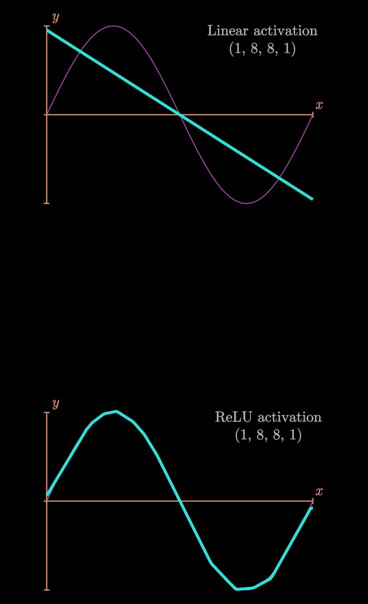
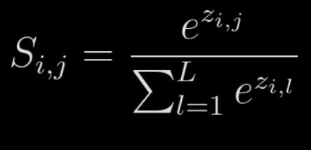

## Activation Functions

---

Activation functions are used to compute the output of a neuron. Its applied on the value, that is resulted from the weights and biases. For example, assume f() to be a activation function. Let x be the output of a particular neuron. Then, f(x) is the final output of the neuron with the activation function applied.

### Step Activation Function

---

This is the simplest form of activation function. This follows the idea weather the neuron is firing or not. If the neuron is firing, then the output is 1. If the neuron is not firing, then the output is 0.


Here is the graph of a step function.

When the output if output is above certain threshold, then the output is 1. Otherwise, the output is 0.

### Linear Activation Function

---

Here, its just x = y.

Nothing is done to the output of the neuron.


### The sigmoid function

---

This is one of the most used activation functions. It is because, this almost never reaches the maximum value of 1. Because of this nature, we get a value between 0 and 1, which helps us decide how sure the network is about certain output.


### Rectified Linear Activation Function (ReLU)

---

This is also one of the most used activation functions. It is because, this is very fast to compute. The simple property of the function being linear above certain threshold, and 0 the other times makes this function very effective, in brining non-linearity to the network.


## Why even use activation functions?

---

Now we have established the fact that our neural netowork is non-linear. Because of this, each layer needs to have some sort of non-linear activaction function to achieve this. When you don't have any activation function, then the output of the neuron is just some sort of linear combination of the input layers. When we know that our data is not linear, we need some sort of activation function to make it fit our data. Consider these examples:



Here is a sine wave, which is non-linear. We are trying to fit a neural network to this. When we use a linear activation function, the achieved result is just a straight line. When we bring in a slight amount of non-linearity with ReLU, you can see it fits the data much better.

[ReLU activation in action for fitting this curve](https://nnfs.io/mvp/)

Now, lets implement Relu in our python code.

```python
#Class for ReLu
class Activation_ReLU:
    #Forward pass of ReLu
    def forward(self, inputs):
        #Actual relu brain
        self.output = np.maximum(0, inputs)
```

Now we will apply this activation function to our neural network.

[ReLu Activation Code - Notebook](./1.Relu_Activation_Sample.ipynb)

You can see that the outputs are clipped to 0. This is what we asked ReLu to do. We can choose any value instead of 0, but 0 is mostly used.

---

### Softmax Activation Function

Softmax is a activation function widely used for classification problems.


This is softmax. We will try to break this via python




What this function basically does is, takes the inputs and normalizes them. This is done by dividing each input by the sum of all the inputs. With this, what we get is, outputs in terms of probablity of each neuron. Now you can get an idea of why this is highly used in classification problems.

```python
#Softmax activation

class Activation_Softmax:
    
    #Forward Pass
    def forward(self, inputs):
        #Get the exponents
        #We subtract the max value to avoid overflow, which is basically avoiding the network to try calculating exponents of very large numbers.
        exp_values = np.exp(inputs - np.max(inputs, axis=1, keepdims=True))
        
        #Get the sum of all the exponents
        sum_exp_values = np.sum(exp_values, axis=1, keepdims=True)
        
        #Get the probabilities
        self.output = exp_values / sum_exp_values
```


Now that we have made the softmax function, We can add this to our neural network and update our complete code up to this point.


Now we will go to notebook, see this code in action

[Complete code upto now](./2.complete_code_now.ipynb)

---

Chapter 4 of nnfs book


