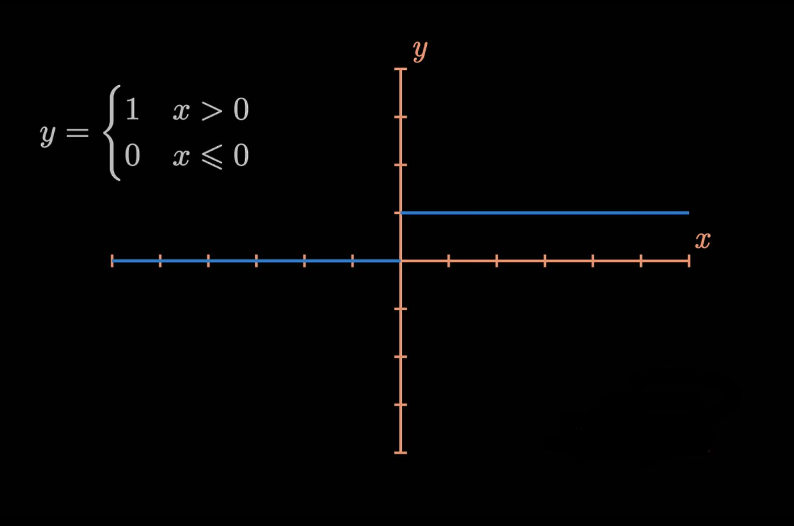
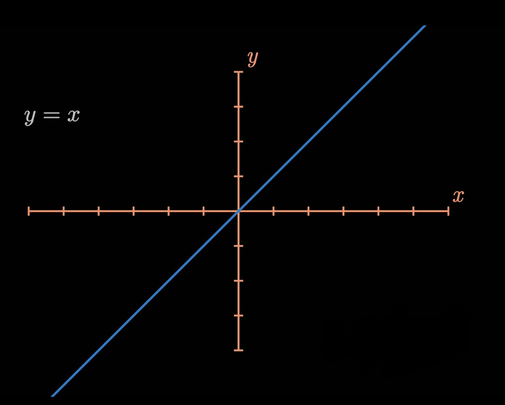
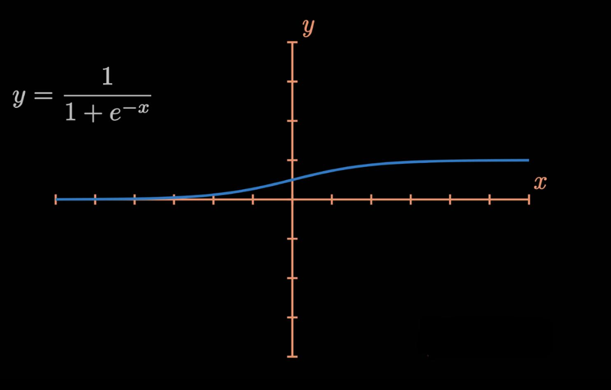
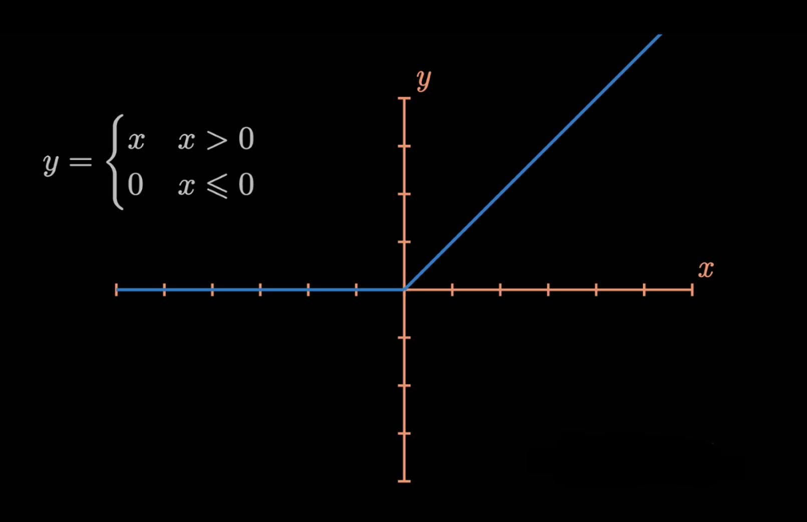

## Activation Functions

---

Activation functions are used to compute the output of a neuron. Its applied on the value, that is resulted from the weights and biases. For example, assume f() to be a activation function. Let x be the output of a particular neuron. Then, f(x) is the final output of the neuron with the activation function applied.

### Step Activation Function

---

This is the simplest form of activation function. This follows the idea weather the neuron is firing or not. If the neuron is firing, then the output is 1. If the neuron is not firing, then the output is 0.

Here is the graph of a step function.

When the output if output is above certain threshold, then the output is 1. Otherwise, the output is 0.

### Linear Activation Function

---

Here, its just x = y.

Nothing is done to the output of the neuron.

### The sigmoid function

---

This is one of the most used activation functions. It is because, this almost never reaches the maximum value of 1. Because of this nature, we get a value between 0 and 1, which helps us decide how sure the network is about certain output.

### Rectified Linear Activation Function (ReLU)

---

This is also one of the most used activation functions. It is because, this is very fast to compute. The simple property of the function being linear above certain threshold, and 0 the other times makes this function very effective, in brining non-linearity to the network.

## Why even use activation functions?
---

Continue Tomorrow.......
