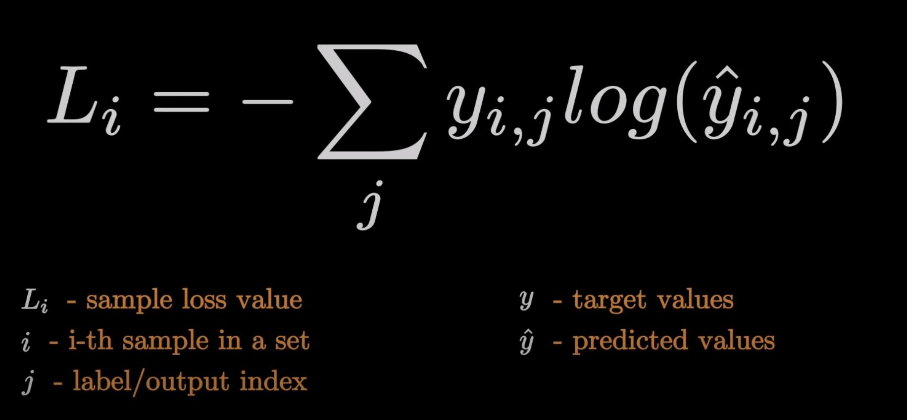

## Calculating Network Error with Loss

---

With any neural network, the aim is to reduce the error in the network. And to do this, we need to calculate the error. When we have the error, we can apply some math magic to manuplate wights and biases in such a way that the error is reduced.

The loss function, also known as cost function, is used to calculate the error. Since loss is the model's error, we would ideally want it to be 0.

### Categorical Cross Entropy




This is the equation for categorical cross entropy.

Imagine we have outputs of `[0.1, 0.7, 0.2]` and targets of `[0, 1, 0]`, then the calculation would be:

```python
LOSS = -(0 * log(0.1)) + (1 * log(0.7)) + (0 * log(0.2))   
#(I am lazy to calculate this)
```

Now we will look at a sample, in python

```python
import math

#Output of the softmax layer
softmax_output = [0.7, 0.1, 0.2]

#The actual output we need
target_output = [1,0,0]

#Calculate the loss
loss = -1 * (
    math.log(softmax_output[0]) * target_output[0] +
    math.log(softmax_output[1]) * target_output[1] +
    math.log(softmax_output[2]) * target_output[2] 
)

print(loss)

>>>
0.3566749439387324
```

Since we are mainly working with a classification problem, the target values will be 0, except for that 1 class which is the target.

So, what we can do is, ignore all other outputs and calculate the loss only for that class of which the ouput was supposed to be 1. Because all other outputs are multipled by 0.\

Now we will try to dynamically calculate the the entropy

```python
softmax_outputs = [ [0.7, 0.1, 0.2],
                    [0.1, 0.5, 0.4],
                    [0.02, 0.9, 0.08]]

class_targets = [0, 1, 1]

for targ_idx, distribution in zip(class_targets, softmax_outputs):
    print(distribution[targ_idx])
>>>
0.7
0.5
0.9
```


You can see in this sample that by using zip(), we iterated over the produced outputs and desiered outputs. Now that we are sure that it selected the right output, we can use it to calculate the loss.

Now we make a class to implement this in python

```python
# Cross-entropy loss
class Loss_CategoricalCrossentropy(Loss):

    # Forward pass
    def forward(self, y_pred, y_true):

        # Number of samples in a batch
        samples = len(y_pred)

        # Clip data to prevent division by 0
        # Clip both sides to not drag mean towards any value
        y_pred_clipped = np.clip(y_pred, 1e-7, 1 - 1e-7)


        # Probabilities for target values -
        # only if categorical labels
        if len(y_true.shape) == 1:
            correct_confidences = y_pred_clipped[
                range(samples),
                y_true
            ]

        # Mask values - only for one-hot encoded labels
        elif len(y_true.shape) == 2:
            correct_confidences = np.sum(
                y_pred_clipped*y_true,
                axis=1
            )

        # Losses
        negative_log_likelihoods = -np.log(correct_confidences)
        return negative_log_likelihoods
```


Now we will update the complete code upto now

[Complete code upto now](./1.Complete_Code.ipynb)

---

Chapter 5 of nnfs book