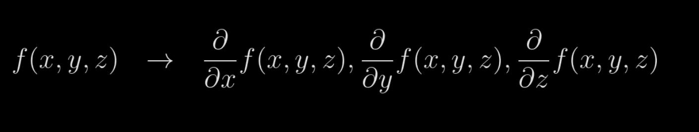
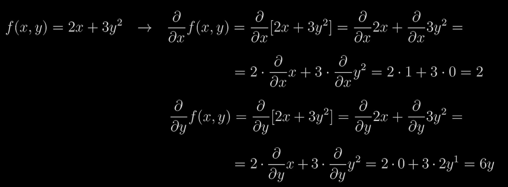
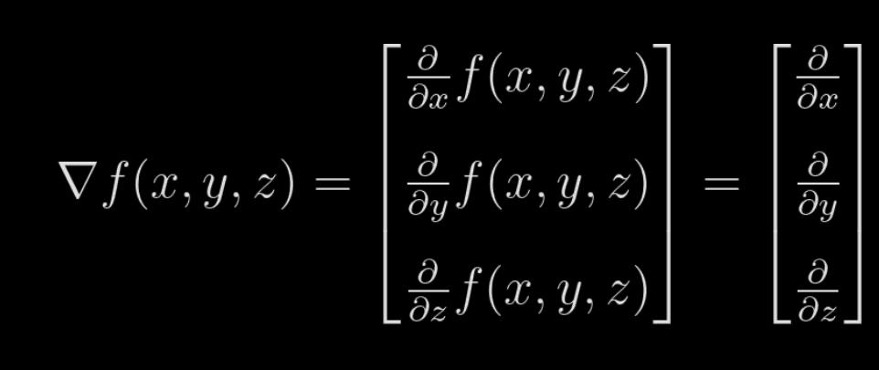

# Partial Derivatives, Gradients, and Chain Rule

The previous chapter introduced the concept of derivatives, but it dealt with single variables. However, the network we are trying to make, is gonna have multiple inputs, which implies that we need to deal with multiple variables.

In simple words, partial dervatives calculate how much 1 variable has impact on a function's output.

Partial derivative is a single equation, and the full multi-variate function's derivative will contain a set of equations. Its called the gradient.

In other words, gradient is a vector of size of the inputs containing the partial derivatives of the output with respect to each input.

Here is an example of a gradient:

Here, each block is a partial derivative, and the entire thing is the gradient.

## Partial Derivative of Sum

Remember that partial derivative is just like doing a normal derivative, but here you assume the other variables to be constant and proceed.

It follows all the rules that normal derivatives follow.

You can see here, its similar to doing a normal derivative.

You can try doing the same for multiplication too!

## The Gradient

Here is an example gradient with 3 variables

That inverted delta symbol is the symbol for gradient.

